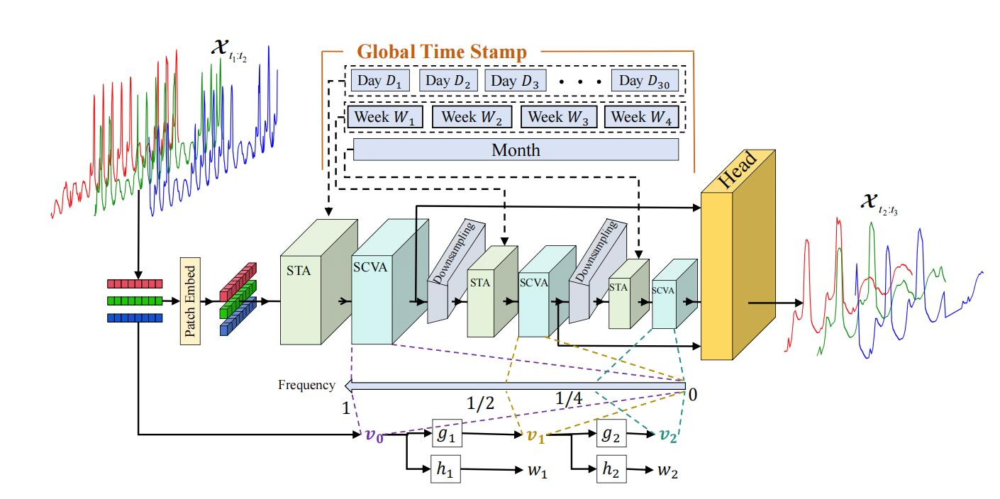

# Exploring the Hierarchical Sparsity in Long-term Multivariate Energy Data for Effective and Efficient Forecasting


This is the origin Pytorch implementation of HST in the following paper: 
[Exploring the Hierarchical Sparsity in Long-term Multivariate Energy Data for Effective and Efficient Forecasting] (Manuscript submitted to IEEE Transactions on Smart Grid). The appendix of this paper can be found at `./appendix/HST_Appendix.pdf`. 

## Model Architecture

<p align="center">

<br><br>
<b>Figure 1.</b> An overview of a three-stage HST model. A multivariate time series composed of three sequences, which are marked with red, green and blue,
is used as an example input. The stages are bridged by downsampling operations and the outputs of all stages are utilized for prediction. The top of the
figure illustrates the global time stamps for hierarical intra-series sparisity, while the bottom illustrates the hierarchical identification procedure for inter-series
sparisity.
</p>


## Requirements
- python == 3.11.4
- numpy == 1.24.3
- pandas == 1.5.3
- scipy == 1.11.3
- torch == 2.1.0+cu118
- scikit-learn == 1.3.0
- PyWavelets == 1.4.1
- astropy == 6.1
- h5py == 3.7.0
- geomstat == 2.5.0

Dependencies can be installed using the following command:
```bash
pip install -r requirements.txt
```

## Raw Data
ECL was acquired at: [here](https://drive.google.com/drive/folders/1ZOYpTUa82_jCcxIdTmyr0LXQfvaM9vIy?usp=sharing). Solar dataset was acquired at: [Solar](https://drive.google.com/drive/folders/1Gv1MXjLo5bLGep4bsqDyaNMI2oQC9GH2?usp=sharing). Wind was acquired at: [Wind]( https://www.kaggle.com/datasets/sohier/30-years-of-european-wind-generation). Hydro was acquired at: [Hydro](https://www.kaggle.com/datasets/mahbuburrahman2020/europe-green-electricity-generation-consumption).

### Data Preparation
After you acquire raw data of all datasets, please separately place them in corresponding folders at `./data`. 

We place ECL in the folder `./electricity` of [here](https://drive.google.com/drive/folders/1ZOYpTUa82_jCcxIdTmyr0LXQfvaM9vIy?usp=sharing) (the folder tree in the link is shown as below) into folder `./data` and rename it from `./electricity` to `./ECL`. We rename the file of ECL from `electricity.csv` to `ECL.csv` and rename its last variable from `OT` to original `MT_321`.
```
The folder tree in https://drive.google.com/drive/folders/1ZOYpTUa82_jCcxIdTmyr0LXQfvaM9vIy?usp=sharing:
|-autoformer
| |-electricity
| | |-electricity.csv
```

To standardize the data format, we convert the data file of [Solar](https://drive.google.com/drive/folders/1Gv1MXjLo5bLGep4bsqDyaNMI2oQC9GH2?usp=sharing) from 'solar_AL.txt' to 'solar_AL.csv'. Then we compress this file and upload it to the folder `./data/Solar`, where you can get the data file by simply unzipping the 'solar_AL.zip' file.

We place the NPZ files ('PEMS03.npz', 'PEMS04.npz', 'PEMS07.npz', 'PEMS08.npz') of PeMSD3, PeMSD4, PeMSD7 and PeMSD8 in the folder `./PEMS03`, `./PEMS03`, `./PEMS03` and `./PEMS03` of [PeMS](https://github.com/guoshnBJTU/ASTGNN/tree/main/data) 
 into the folder `./data/PEMS`. We place the H5 file ('pems-bay.h5') of PeMS-Bay in the [PeMS-Bay](https://drive.google.com/drive/folders/10FOTa6HXPqX8Pf5WRoRwcFnW9BrNZEIX) into the folder `./data/PEMS`. The folder trees in the mentioned two links are shown as below:

```
The folder tree in https://github.com/guoshnBJTU/ASTGNN/tree/main/data:
|-PEMS03
| |-PEMS03.csv
| |-PEMS03.npz
| |-PEMS03.txt
|-PEMS04
| |-PEMS04.csv
| |-PEMS04.npz
|-PEMS07
| |-PEMS07.csv
| |-PEMS07.npz
|-PEMS08
| |-PEMS08.csv
| |-PEMS08.npz

The folder tree in https://drive.google.com/drive/folders/10FOTa6HXPqX8Pf5WRoRwcFnW9BrNZEIX:
|-metr-la.h5
|-pems-bay.h5
```

After you process all the datasets, you will obtain folder tree:
```
|-data
| |-ECL
| | |-ECL.csv
| |
| |-ETT
| | |-ETTh1.csv
| | |-ETTh2.csv
| | |-ETTm1.csv
| | |-ETTm2.csv
| |
| |-PEMS
| | |-PEMS03.npz
| | |-PEMS04.npz
| | |-PEMS07.npz
| | |-PEMS08.npz
| | |-pems-bay.h5
| |
| |-Solar
| | |-solar_AL.csv
| |
| |-Traffic
| | |-Traffic.csv
| |
| |-weather
| | |-weather.csv

```

## Usage
Commands for training and testing FPPformer-MD of all datasets are in `./scripts/Main.sh`. 

More parameter information please refer to `main.py`.

We provide a complete command for training and testing FPPformer-MD:

```
python -u main.py --data <data> --input_len <input_len> --pred_len <pred_len> --encoder_layer <encoder_layer> --layer_stack <layer_stack> --MODWT_level<MODWT_level> --patch_size<patch_size> --d_model <d_model> --augmentation_len<augmentation_len> --augmentation_ratio<augmentation_ratio>  --learning_rate <learning_rate> --dropout <dropout> --batch_size <batch_size> --train_epochs <train_epochs> --itr <itr> --train --decoder_IN --patience <patience> --decay<decay>
```

Here we provide a more detailed and complete command description for training and testing the model:

| Parameter name |                                          Description of parameter                                          |
|:--------------:|:----------------------------------------------------------------------------------------------------------:|
|      data      |                                              The dataset name                                              |
|   root_path    |                                       The root path of the data file                                       |
|   data_path    |                                             The data file name                                             |
|  checkpoints   |                                       Location of model checkpoints                                        |
|   input_len    |                                           Input sequence length                                            |
|    pred_len    |                                         Prediction sequence length                                         |
|     enc_in     |                                                 Input size                                                 |
|    dec_out     |                                                Output size                                                 |
|    d_model     |                                             Dimension of model                                             |
|  encoder_layer |                                            The number of stages                                            |
|   layer_stack  |                                       The number of layers per stage                                       |
|   patch_size   |                                The initial patch size in patch-wise attention                              |
|  MODWT_level   |                                           The level of MODWT/MRA                                           |
|augmentation_method   |                                           Augmentation method                                           |
|  augmentation_ratio   |                                           Augmentation ratio                                           |
|  augmentation_len   |                                           Augmentation length                                           |
|  decoder_IN   |                                          Whether to perform IN for decoder inputh                                           |
|    dropout     |                                                  Dropout                                                   |
|    num_workers     |                                                  Data loader num workers                                                   |
|      itr       |                                             Experiments times                                              |
|  train_epochs  |                                      Train epochs of the second stage                                      |
|   batch_size   |                         The batch size of training input data                          |
|   decay   |                         Decay rate of learning rate per epoch                         |
|    patience    |                                          Early stopping patience                                           |
| learning_rate  |                                          Optimizer learning rate                                           |


## Results
The experiment parameters of each data set are formated in the `Main.sh` files in the directory `./scripts/`. You can refer to these parameters for experiments, and you can also adjust the parameters to obtain better mse and mae results or draw better prediction figures. We also provide the commands for obtain the results of FPPformer-MD with longer input sequence length (336) in the file `./scripts/Main.sh`. We present the full results of multivariate forecasting results in Figure 2 and Figure 3. Moreover, we compare FPPformer-MD with other outperforming baselines equipped with individual settings in Figure 4.

<p align="center">

<br><br>
<b>Figure 2.</b> Multivariate forecasting results (Input length = 96). ETTh denotes the average of ETTh1 and ETTh2. ETTm denotes the average of ETTm1 and ETTm2. PeMS denotes the average of {PeMSD3, PeMSD4, PeMSD7, PeMSD8}.
</p>

<p align="center">

<br><br>
<b>Figure 3.</b> Full multivariate forecasting results (Input length = 96)
</p>

<p align="center">

<br><br>
<b>Figure 4.</b> Multivariate forecasting results (Individual settings)
</p>


## Contact
If you have any questions, feel free to contact Li Shen through Email (shenli@buaa.edu.cn) or Github issues. Pull requests are highly welcomed!
