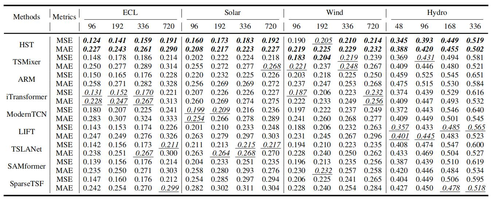

# Exploring the Hierarchical Sparsity in Long-term Multivariate Energy Data for Effective and Efficient Forecasting


This is the origin Pytorch implementation of HST in the following paper: 
[Exploring the Hierarchical Sparsity in Long-term Multivariate Energy Data for Effective and Efficient Forecasting] (Manuscript submitted to IEEE Transactions on Smart Grid). The appendix of this paper can be found at `./appendix/HST_Appendix.pdf`. 

## Model Architecture

<p align="center">

<br><br>
<b>Figure 1.</b> An overview of a three-stage HST model. A multivariate time series composed of three sequences, which are marked with red, green and blue,
is used as an example input. The stages are bridged by downsampling operations and the outputs of all stages are utilized for prediction. The top of the
figure illustrates the global time stamps for hierarical intra-series sparisity, while the bottom illustrates the hierarchical identification procedure for inter-series
sparisity.
</p>


## Requirements
- python == 3.11.4
- numpy == 1.24.3
- pandas == 1.5.3
- scipy == 1.11.3
- torch == 2.1.0+cu118
- scikit-learn == 1.3.0
- PyWavelets == 1.4.1
- astropy == 6.1
- h5py == 3.7.0
- geomstat == 2.5.0

Dependencies can be installed using the following command:
```bash
pip install -r requirements.txt
```

## Raw Data
ECL was acquired at: [here](https://drive.google.com/drive/folders/1ZOYpTUa82_jCcxIdTmyr0LXQfvaM9vIy?usp=sharing). Solar dataset was acquired at: [Solar](https://drive.google.com/drive/folders/12ffxwxVAGM_MQiYpIk9aBLQrb2xQupT-). Wind was acquired at: [Wind]( https://www.kaggle.com/datasets/sohier/30-years-of-european-wind-generation). Hydro was acquired at: [Hydro](https://www.kaggle.com/datasets/mahbuburrahman2020/europe-green-electricity-generation-consumption).

### Data Preparation
We supply all processed datasets and put them under `./data`, the folder tree is shown below:
```
|-data
| |-ECL
| | |-ECL.csv
| |
| |-Hydro_BXX
| | |-Hydro_BXX.csv
| |
| |-Solar
| | |-solar_AL.csv
| |
| |-Wind
| | |-Wind.csv
| |
| ...
```

The processing details for the four datasets are as follows. We place ECL in the folder `./electricity` of [here](https://drive.google.com/drive/folders/1ZOYpTUa82_jCcxIdTmyr0LXQfvaM9vIy?usp=sharing) (the folder tree in the link is shown as below) into folder `./data` and rename it from `./electricity` to `./ECL`. We rename the file of ECL from `electricity.csv` to `ECL.csv` and rename its last variable from `OT` to original `MT_321`. The processed file can be found at `./data/ECL/ECL.csv`
```
The folder tree in https://drive.google.com/drive/folders/1ZOYpTUa82_jCcxIdTmyr0LXQfvaM9vIy?usp=sharing:
|-autoformer
| |-electricity
| | |-electricity.csv
```
To standardize the data format, we convert the data file of [Solar](https://drive.google.com/drive/folders/12ffxwxVAGM_MQiYpIk9aBLQrb2xQupT-) from 'solar_AL.txt' to 'solar_AL.csv'. We place the processed file into the folder `./data/Solar`. For convenience, we processed the Wind and Hydro datasets and you can obtain the processed files at `./data/Wind/Wind.csv` and `./data/Hydro_BXX/Hydro_BXX.csv`, respectively.

## Usage
Commands for training and testing HST of all datasets are in `./scripts/Main.sh`. 

More parameter information please refer to `main.py`.

We provide a complete command for training and testing HST:

```
python -u main.py --data <data> --input_len <input_len> --pred_len <pred_len> --period <period> --encoder_layer <encoder_layer> --layer_stack <layer_stack> --MODWT_level<MODWT_level> --patch_size<patch_size> --ccc_number <ccc_number> --d_model <d_model> --learning_rate <learning_rate> --dropout <dropout> --batch_size <batch_size> --train_epochs <train_epochs> --itr <itr> --train --patience <patience> --decay<decay>
```

Here we provide a more detailed and complete command description for training and testing the model:

| Parameter name |                                          Description of parameter                                          |
|:--------------:|:----------------------------------------------------------------------------------------------------------:|
|      data      |                                              The dataset name                                              |
|   root_path    |                                       The root path of the data file                                       |
|   data_path    |                                             The data file name                                             |
|  checkpoints   |                                       Location of model checkpoints                                        |
|   input_len    |                                           Input sequence length                                            |
|    pred_len    |                                         Prediction sequence length                                         |
|    period    |                                         Vested periods for global timestamps                                         |
|     enc_in     |                                                 Input variable number                                                |
|    dec_out     |                                                Output variable number                                             |
|    d_model     |                                             Hidden dims of model                                             |
|  encoder_layer |                                            The number of stages                                            |
|   layer_stack  |                                       The number of layers per stage                                       |
|   patch_size   |                                The initial patch size in patch-wise attention                              |
|  MODWT_level   |                                           The level of MODWT/MRA                                           |
|  ccc_num  |                                           Number of correlated variables                                           |
|    dropout     |                                                  Dropout                                                   |
|    num_workers     |                                                  Data loader num workers                                                   |
|      itr       |                                             Experiments times                                              |
|  train_epochs  |                                      Train epochs of the second stage                                      |
|   batch_size   |                         The batch size of training input data                          |
|   decay   |                         Decay rate of learning rate per epoch                         |
|    patience    |                                          Early stopping patience                                           |
| learning_rate  |                                          Optimizer learning rate                                           |


## Results
The experiment parameters of each dataset are formated in the `Main.sh` files in the directory `./scripts/`. You can refer to these parameters for experiments, and you can also adjust the parameters to obtain better mse and mae results or draw better prediction figures. We present the multivariate forecasting results of the four datasets in Figure 2.

<p align="center">

<br><br>
<b>Figure 2.</b> Multivariate forecasting results (Input length = 336).
</p>


## Contact
If you have any questions, feel free to contact Li Shen through Email (shenli@buaa.edu.cn) or Github issues. Pull requests are highly welcomed!
